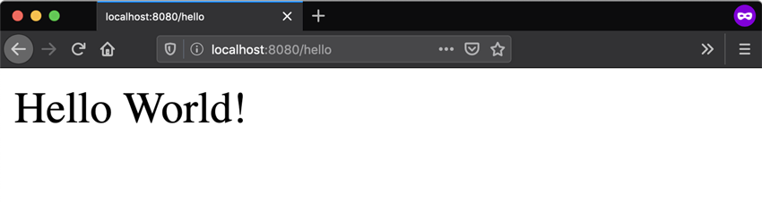

## 第1步：启动一个新的 Spring Boot 项目

使用 [start.spring.io](https://start.spring.io/) 创建一个“web”项目。 在“Dependencies”对话框中搜索并添加“web”依赖项，如屏幕截图所示。 点击“Generate”按钮，下载 zip，然后将其解压缩到计算机上的文件夹中。

[start.spring.io](https://start.spring.io/) 创建的项目包含 [Spring Boot](https://spring.io/projects/spring-boot)，这是一个让 Spring 准备好在您的应用程序中工作的框架，但不需要太多代码或配置。 Spring Boot 是启动 Spring 项目的最快和最流行的方式。

## 第2步：添加您的代码

在 IDE 中打开项目并在文件夹中找到该文件。 现在通过添加下面代码中显示的额外方法和注释来更改文件的内容。 您可以复制并粘贴代码或直接键入它。`DemoApplication.java``src/main/java/com/example/demo`


package com.example.demo;
import org.springframework.boot.SpringApplication;
import org.springframework.boot.autoconfigure.SpringBootApplication;
import org.springframework.web.bind.annotation.GetMapping;
import org.springframework.web.bind.annotation.RequestParam;
import org.springframework.web.bind.annotation.RestController;

@SpringBootApplication
@RestController
public class DemoApplication {

    
    public static void main(String[] args) {
    SpringApplication.run(DemoApplication.class, args);
    }
    
    @GetMapping("/hello")
    public String hello(@RequestParam(value = "name", defaultValue = "World") String name) {
    return String.format("Hello %s!", name);
    }

}

>This is all the code required to create a simple “Hello World” web service in Spring Boot.

我们添加的方法旨在获取一个字符串参数，然后将该参数与代码中的单词结合起来。 这意味着如果你在请求中设置你的名字，响应将是 .`hello()``name``"Hello Amy"`

注释告诉 Spring 这段代码描述了一个应该在 web 上可用的端点。 告诉 Spring 使用我们的方法来回答发送到该地址的请求。 最后，告诉 Spring 在请求中期待一个值，但如果它不存在，它将默认使用单词“World”。`@RestController``@GetMapping(“/hello”)``hello()``http://localhost: 8080/hello``@RequestParam``name`

## 第3步：尝试一下

让我们构建并运行程序。 打开命令行（或终端）并导航到您拥有项目文件的文件夹。 我们可以通过发出以下命令来构建和运行应用程序：

### MacOS/Linux:

./mvnw spring-boot:run


### Windows:

mvnw spring-boot:run

您应该会看到一些与此非常相似的输出：

这里的最后几行告诉我们Spring已经开始了。 Spring Boot 的嵌入式 Apache Tomcat 服务器充当 Web 服务器，并正在侦听端口上的请求。 打开浏览器并在顶部的地址栏中输入 `http://localhost:8080/hello`。 你应该得到一个很好的友好回应，如下所示：
