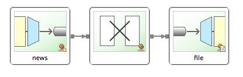

本指南将引导您完成使用 Spring Integration 创建一个简单的应用程序的过程，该应用程序从 RSS Feed（Spring 博客）检索数据、操作数据，然后将其写入文件。 本指南使用传统的 Spring Integration XML 配置。 其他指南展示了如何在有和没有 JDK 8 Lambda 表达式的情况下使用 Java 配置和 DSL。

## 你将建造什么
您将使用传统的 XML 配置使用 Spring Integration 创建流。

## 你需要什么

* 约15分钟
* 最喜欢的文本编辑器或 IDE
* [JDK 1.8](https://www.oracle.com/java/technologies/downloads/) 或更高版本
* [Gradle 4+](http://www.gradle.org/downloads) 或[ Maven 3.2+](https://maven.apache.org/download.cgi)
* 您还可以将代码直接导入 IDE：
  * [Spring Tool Suite (STS)](https://spring.io/guides/gs/sts)
  * [IntelliJ IDEA](https://spring.io/guides/gs/intellij-idea/)

## 如何完成本指南
像大多数 [Spring 入门指南](https://spring.io/guides)一样，您可以从头开始并完成每个步骤，也可以绕过您已经熟悉的基本设置步骤。 无论哪种方式，您最终都会得到工作代码。

要从头开始，请继续从 [Spring Initializr](##从SpringInitializr开始) 开始。

要跳过基础知识，请执行以下操作：

* [下载](https://github.com/spring-guides/gs-spring-boot/archive/main.zip)并解压本指南的源代码库，或使用 Git 克隆它： `git clone https://github.com/spring-guides/gs-spring-boot.git`
* cd 进入 `gs-spring-boot/initial`
* 跳转到创建一个简单的 Web 应用程序。

完成后，您可以对照 `gs-spring-boot/complete` 中的代码检查结果。

## 从SpringInitializr开始
您可以使用[pre-initialized project](https://start.spring.io/#!type=maven-project&language=java&platformVersion=2.5.5&packaging=jar&jvmVersion=11&groupId=com.example&artifactId=spring-boot&name=spring-boot&description=Demo%20project%20for%20Spring%20Boot&packageName=com.example.spring-boot&dependencies=web)并单击 Generate 下载 ZIP 文件。 此项目配置为适合本教程中的示例。

手动初始化项目：

1. 导航到 [https://start.spring.io](https://start.spring.io/)。 该服务提取应用程序所需的所有依赖项，并为您完成大部分设置。
2. 选择 Gradle 或 Maven 以及您要使用的语言。 本指南假定您选择了 Java。
3. 单击**Dependencies**并选择**Spring Web**。
4. 单击**Generate**。
5. 下载生成的 ZIP 文件，该文件是根据您的选择配置的 Web 应用程序的存档。

>如果您的 IDE 具有 Spring Initializr 集成，您可以从您的 IDE 完成此过程。

>你也可以从 Github 上 fork 项目并在你的 IDE 或其他编辑器中打开它。

## 添加到构建文件
对于此示例，您需要添加两个依赖项：
* `spring-integration-feed`
* `spring-integration-file`

以下清单显示了最终的 `pom.xml` 文件：

<?xml version="1.0" encoding="UTF-8"?>
<project xmlns="http://maven.apache.org/POM/4.0.0" xmlns:xsi="http://www.w3.org/2001/XMLSchema-instance"
	xsi:schemaLocation="http://maven.apache.org/POM/4.0.0 https://maven.apache.org/xsd/maven-4.0.0.xsd">
	<modelVersion>4.0.0</modelVersion>
	<parent>
		<groupId>org.springframework.boot</groupId>
		<artifactId>spring-boot-starter-parent</artifactId>
		<version>2.6.3</version>
		<relativePath/> <!-- lookup parent from repository -->
	</parent>
	<groupId>com.example</groupId>
	<artifactId>integration-complete</artifactId>
	<version>0.0.1-SNAPSHOT</version>
	<name>integration-complete</name>
	<description>Demo project for Spring Boot</description>

	<properties>
		<java.version>1.8</java.version>
	</properties>

	<dependencies>
		<dependency>
			<groupId>org.springframework.boot</groupId>
			<artifactId>spring-boot-starter-integration</artifactId>
		</dependency>
		<dependency>
			<groupId>org.springframework.integration</groupId>
			<artifactId>spring-integration-feed</artifactId>
		</dependency>
		<dependency>
			<groupId>org.springframework.integration</groupId>
			<artifactId>spring-integration-file</artifactId>
		</dependency>

		<dependency>
			<groupId>org.springframework.boot</groupId>
			<artifactId>spring-boot-starter-test</artifactId>
			<scope>test</scope>
		</dependency>
		<dependency>
			<groupId>org.springframework.integration</groupId>
			<artifactId>spring-integration-test</artifactId>
			<scope>test</scope>
		</dependency>
	</dependencies>

	<build>
		<plugins>
			<plugin>
				<groupId>org.springframework.boot</groupId>
				<artifactId>spring-boot-maven-plugin</artifactId>
			</plugin>
		</plugins>
	</build>

</project>


以下清单显示了最终的 `build.gradle` 文件：

plugins {
	id 'org.springframework.boot' version '2.6.3'
	id 'io.spring.dependency-management' version '1.0.11.RELEASE'
	id 'java'
}

group = 'com.example'
version = '0.0.1-SNAPSHOT'
sourceCompatibility = '1.8'

repositories {
	mavenCentral()
}

dependencies {
	implementation 'org.springframework.boot:spring-boot-starter-integration'
	implementation 'org.springframework.integration:spring-integration-feed'
	implementation 'org.springframework.integration:spring-integration-file'
	testImplementation('org.springframework.boot:spring-boot-starter-test')
	testImplementation 'org.springframework.integration:spring-integration-test'
}

test {
	useJUnitPlatform()
}


## 定义集成流
对于本指南的示例应用程序，您将定义一个 Spring 集成流：
* 从 spring.io 的 RSS 提要中读取博客文章。
* 将它们转换为由帖子标题和帖子 URL 组成的易于阅读的`String`。
* 将该`String`附加到文件的末尾（`/tmp/si/SpringBlog`）。

要定义集成流，您可以使用 Spring Integration 的 XML 命名空间中的一些元素创建一个 Spring XML 配置。 具体来说，对于所需的集成流程，您可以使用这些 Spring Integration 命名空间中的元素：core、feed和file。 （获取最后两个是我们必须修改 Spring Initializr 提供的构建文件的原因。）

以下 XML 配置文件（来自 `src/main/resources/integration/integration.xml`）定义了集成流程：

<?xml version="1.0" encoding="UTF-8"?>
<beans xmlns="http://www.springframework.org/schema/beans"
	xmlns:xsi="http://www.w3.org/2001/XMLSchema-instance"
	xmlns:int="http://www.springframework.org/schema/integration"
	xmlns:file="http://www.springframework.org/schema/integration/file"
	xmlns:feed="http://www.springframework.org/schema/integration/feed"
	xsi:schemaLocation="http://www.springframework.org/schema/integration/feed https://www.springframework.org/schema/integration/feed/spring-integration-feed.xsd
		http://www.springframework.org/schema/beans https://www.springframework.org/schema/beans/spring-beans.xsd
		http://www.springframework.org/schema/integration/file https://www.springframework.org/schema/integration/file/spring-integration-file.xsd
		http://www.springframework.org/schema/integration https://www.springframework.org/schema/integration/spring-integration.xsd">

    <feed:inbound-channel-adapter id="news" url="https://spring.io/blog.atom" auto-startup="${auto.startup:true}">
        <int:poller fixed-rate="5000"/>
    </feed:inbound-channel-adapter>

    <int:transformer
            input-channel="news"
            expression="payload.title + ' @ ' + payload.link + '#{systemProperties['line.separator']}'"
            output-channel="file"/>

    <file:outbound-channel-adapter id="file"
            mode="APPEND"
            charset="UTF-8"
            directory="/tmp/si"
            filename-generator-expression="'${feed.file.name:SpringBlog}'"/>

</beans>

这里有三个集成元素：

* `<feed:inbound-channel-adapter>`：检索帖子的入站适配器，每个轮询一个。 按照此处的配置，它每五秒轮询一次。 这些帖子被放置在一个名为 `news` 的频道中（对应于适配器的 ID）。

* `<int:transformer>`：转换`news`频道中的条目（`com.rometools.rome.feed.synd.SyndEntry`），提取条目的标题（`payload.title`）和链接（`payload.link`）并将它们连接成可读的`String`（ 并添加换行符）。 然后将`String`发送到名为 `file` 的输出通道。

* `<file:outbound-channel-adapter>`：将内容从其通道（命名`file`）写入文件的出站通道适配器。 具体来说，正如此处配置的那样，它将`file`通道中的任何内容附加到 `/tmp/si/SpringBlog` 的文件中。

下图显示了这个简单的流程：

现在忽略`auto-startup`属性。我们稍后在讨论测试时会重新讨论这一点。现在，请注意默认情况下它为 `true`，这意味着在应用程序启动时获取帖子。还要注意`filename-generator-expression`中的属性占位符。这意味着默认是 `SpringBlog` 但可以用属性覆盖。

## 使应用程序可执行
尽管在较大的应用程序（甚至可能是 Web 应用程序）中配置 Spring Integration 流是很常见的，但没有理由不能在更简单的独立应用程序中定义它。这就是您接下来要做的事情：创建一个启动集成流的主类，并声明一些 bean 来支持集成流。您还将应用程序构建成一个独立的可执行 JAR 文件。我们使用 Spring Boot 的 `@SpringBootApplication` 注解来创建应用上下文。由于本指南将 XML 命名空间用于集成流，因此您必须使用 `@ImportResource` 注释将其加载到应用程序上下文中。以下清单（来自 `src/main/java/com/example/integration/IntegrationApplication.java`）显示了应用程序文件：

package com.example.integration;

import org.springframework.boot.SpringApplication;
import org.springframework.boot.autoconfigure.SpringBootApplication;
import org.springframework.context.ConfigurableApplicationContext;
import org.springframework.context.annotation.ImportResource;

@SpringBootApplication
@ImportResource("/integration/integration.xml")
public class IntegrationApplication {
  public static void main(String[] args) throws Exception {
    ConfigurableApplicationContext ctx = new SpringApplication(IntegrationApplication.class).run(args);
    System.out.println("Hit Enter to terminate");
    System.in.read();
    ctx.close();
  }

}

## 构建一个可执行的 JAR
您可以使用 Gradle 或 Maven 从命令行运行应用程序。 您还可以构建一个包含所有必要依赖项、类和资源的单个可执行 JAR 文件并运行它。 构建可执行 jar 可以在整个开发生命周期、跨不同环境等中轻松地作为应用程序交付、版本化和部署服务。

如果您使用 Gradle，则可以使用 `./gradlew bootRun` 运行应用程序。 或者，您可以使用 `./gradlew build` 构建 JAR 文件，然后运行 JAR 文件，如下所示：

java -jar build/libs/gs-integration-0.1.0.jar

如果您使用 Maven，则可以使用 `./mvnw spring-boot:run` 运行应用程序。 或者，您可以使用 `./mvnw clean package` 构建 JAR 文件，然后运行 JAR 文件，如下所示：

java -jar target/gs-integration-0.1.0.jar

>此处描述的步骤创建了一个可运行的 JAR。 您还可以构建经典的 WAR 文件。

## 运行应用程序
现在您可以通过运行以下命令从 jar 中运行应用程序：

java -jar build/libs/{project_id}-0.1.0.jar
... app starts up ...


一旦应用程序启动，它就会连接到 RSS 提要并开始获取博客文章。 应用程序通过您定义的集成流程处理这些帖子，最终将帖子信息附加到 `/tmp/si/SpringBlog`的文件中。

应用程序运行一段时间后，您应该能够查看 `/tmp/si/SpringBlog `中的文件，以查看来自少数帖子的数据。 在基于 UNIX 的操作系统上，您还可以通过运行以下命令`tail`文件以查看写入的结果：

tail -f /tmp/si/SpringBlog

您应该看到类似于以下示例输出的内容（尽管实际消息会有所不同）：

Spring Integration Java DSL 1.0 GA Released @ https://spring.io/blog/2014/11/24/spring-integration-java-dsl-1-0-ga-released
This Week in Spring - November 25th, 2014 @ https://spring.io/blog/2014/11/25/this-week-in-spring-november-25th-2014
Spring Integration Java DSL: Line by line tutorial @ https://spring.io/blog/2014/11/25/spring-integration-java-dsl-line-by-line-tutorial
Spring for Apache Hadoop 2.1.0.M2 Released @ https://spring.io/blog/2014/11/14/spring-for-apache-hadoop-2-1-0-m2-released


## 测试
检查`complete`的项目，您将在 `src/test/java/com/example/integration/FlowTests.java` 中看到一个测试用例：

package com.example.integration;

import static org.assertj.core.api.Assertions.assertThat;

import java.io.BufferedReader;
import java.io.File;
import java.io.FileReader;

import org.junit.jupiter.api.Test;

import org.springframework.beans.factory.annotation.Autowired;
import org.springframework.boot.test.context.SpringBootTest;
import org.springframework.integration.endpoint.SourcePollingChannelAdapter;
import org.springframework.integration.support.MessageBuilder;
import org.springframework.messaging.MessageChannel;

import com.rometools.rome.feed.synd.SyndEntryImpl;

@SpringBootTest({ "auto.startup=false",   // we don't want to start the real feed
          "feed.file.name=Test" })   // use a different file
public class FlowTests {

  @Autowired
  private SourcePollingChannelAdapter newsAdapter;

  @Autowired
  private MessageChannel news;

  @Test
  public void test() throws Exception {
    assertThat(this.newsAdapter.isRunning()).isFalse();
    SyndEntryImpl syndEntry = new SyndEntryImpl();
    syndEntry.setTitle("Test Title");
    syndEntry.setLink("http://characters/frodo");
    File out = new File("/tmp/si/Test");
    out.delete();
    assertThat(out.exists()).isFalse();
    this.news.send(MessageBuilder.withPayload(syndEntry).build());
    assertThat(out.exists()).isTrue();
    BufferedReader br = new BufferedReader(new FileReader(out));
    String line = br.readLine();
    assertThat(line).isEqualTo("Test Title @ http://characters/frodo");
    br.close();
    out.delete();
  }

}


此测试使用 Spring Boot 的测试支持将名为 `auto.startup` 的属性设置为 `false`。 依赖网络连接进行测试通常不是一个好主意，尤其是在 CI 环境中。 相反，我们阻止 feed 适配器启动并将 `SyndEntry` 注入到`news`通道中，以供流的其余部分处理。 该测试还设置 `feed.file.name` 以便测试写入不同的文件。 然后它：
* 验证适配器是否已停止。
* 创建一个测试 `SyndEntry`。
* 删除测试输出文件（如果存在）。
* 发送消息。
* 验证文件是否存在。
* 读取文件并验证数据是否符合预期。

## 概括
恭喜！ 您已经开发了一个简单的应用程序，它使用 Spring Integration 从 spring.io 获取博客文章、处理它们并将它们写入文件。

更多详情请访问：[IT-eyes](https://it-eyes.top)