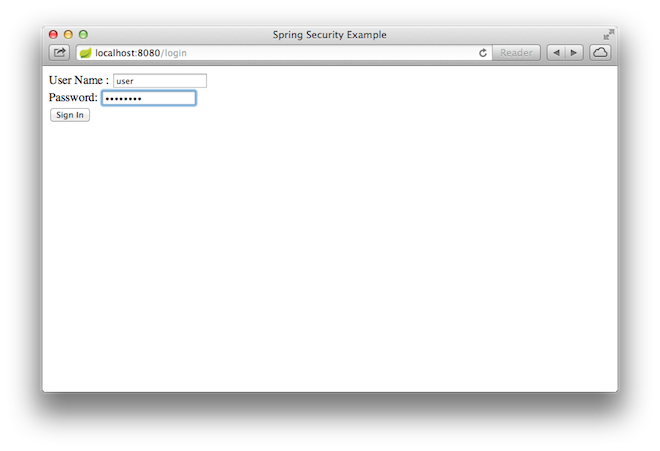
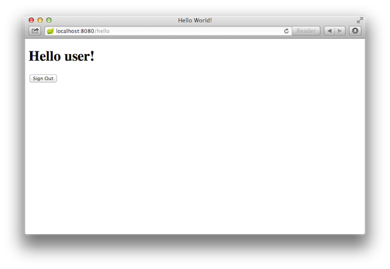

本指南将引导您完成使用受 Spring Security 保护的资源创建简单 Web 应用程序的过程。

## 你将建造什么
您将构建一个 Spring MVC 应用程序，该应用程序使用由固定用户列表支持的登录表单来保护页面。

## 你需要什么

* 约15分钟
* 最喜欢的文本编辑器或 IDE
* [JDK 1.8](https://www.oracle.com/java/technologies/downloads/) 或更高版本
* [Gradle 4+](http://www.gradle.org/downloads) 或[ Maven 3.2+](https://maven.apache.org/download.cgi)
* 您还可以将代码直接导入 IDE：
  * [Spring Tool Suite (STS)](https://spring.io/guides/gs/sts)
  * [IntelliJ IDEA](https://spring.io/guides/gs/intellij-idea/)

## 如何完成本指南
像大多数 [Spring 入门指南](https://spring.io/guides)一样，您可以从头开始并完成每个步骤，也可以绕过您已经熟悉的基本设置步骤。 无论哪种方式，您最终都会得到工作代码。

要从头开始，请继续从 [Spring Initializr](##从SpringInitializr开始) 开始。

要跳过基础知识，请执行以下操作：

* [下载](https://github.com/spring-guides/gs-securing-web/archive/main.zip)并解压本指南的源代码库，或使用 Git 克隆它： `git clone https://github.com/spring-guides/gs-securing-web.git`
* cd 进入 `gs-securing-web/initial`
* 跳转到创建不安全的web应用。

完成后，您可以对照 `gs-securing-web/complete` 中的代码检查结果。

## 从SpringInitializr开始
您可以使用这个预先初始化的项目并单击 Generate 下载 ZIP 文件。 此项目配置为适合本教程中的示例。

手动初始化项目：

1. 导航到 [https://start.spring.io](https://start.spring.io/)。 该服务提取应用程序所需的所有依赖项，并为您完成大部分设置。
2. 选择 Gradle 或 Maven 以及您要使用的语言。 本指南假定您选择了 Java。
3. 点击**Dependencies**并选择**Spring Web**和**Thymeleaf**。
4. 单击**Generate**。
5. 下载生成的 ZIP 文件，该文件是根据您的选择配置的 Web 应用程序的存档。

>如果您的 IDE 具有 Spring Initializr 集成，您可以从您的 IDE 完成此过程。

>你也可以从 Github 上 fork 项目并在你的 IDE 或其他编辑器中打开它。

## 创建不安全的 Web 应用程序
在将安全性应用到 Web 应用程序之前，您需要一个 Web 应用程序来保护。 本部分将引导您创建一个简单的 Web 应用程序。 然后，您将在下一节中使用 Spring Security 对其进行保护。

Web 应用程序包括两个简单的视图：一个主页和一个“Hello, World”页面。 主页在以下 Thymeleaf 模板中定义（来自 `src/main/resources/templates/home.html`）：

<!DOCTYPE html>
<html xmlns="http://www.w3.org/1999/xhtml" xmlns:th="https://www.thymeleaf.org" xmlns:sec="https://www.thymeleaf.org/thymeleaf-extras-springsecurity3">
    <head>
        <title>Spring Security Example</title>
    </head>
    <body>
        <h1>Welcome!</h1>
        
        
Click <a th:href="@{/hello}">here</a> to see a greeting.

    </body>
</html>


这个简单的视图包含一个指向 `/hello` 页面的链接，该页面在以下 Thymeleaf 模板中定义（来自 `src/main/resources/templates/hello.html`）：

<!DOCTYPE html>
<html xmlns="http://www.w3.org/1999/xhtml" xmlns:th="https://www.thymeleaf.org"
      xmlns:sec="https://www.thymeleaf.org/thymeleaf-extras-springsecurity3">
    <head>
        <title>Hello World!</title>
    </head>
    <body>
        <h1>Hello world!</h1>
    </body>
</html>


Web 应用程序基于 Spring MVC。 因此，您需要配置 Spring MVC 并设置视图控制器来公开这些模板。 以下清单（来自 `src/main/java/com/example/securingweb/MvcConfig.java`）显示了一个在应用程序中配置 Spring MVC 的类：

package com.example.securingweb;

import org.springframework.context.annotation.Configuration;
import org.springframework.web.servlet.config.annotation.ViewControllerRegistry;
import org.springframework.web.servlet.config.annotation.WebMvcConfigurer;

@Configuration
public class MvcConfig implements WebMvcConfigurer {

	public void addViewControllers(ViewControllerRegistry registry) {
		registry.addViewController("/home").setViewName("home");
		registry.addViewController("/").setViewName("home");
		registry.addViewController("/hello").setViewName("hello");
		registry.addViewController("/login").setViewName("login");
	}

}


`addViewControllers()` 方法（覆盖 `WebMvcConfigurer` 中的同名方法）添加了四个视图控制器。两个视图控制器引用名为 `home` 的视图（在 `home.html` 中定义），另一个引用名为 `hello` 的视图（在 `hello.html` 中定义）。第四个视图控制器引用另一个名为 `login` 的视图。您将在下一节中创建该视图。

此时，您可以跳到“运行应用程序”并运行应用程序，而无需登录任何东西。

现在您有了一个不安全的 Web 应用程序，您可以为其添加安全性。

## 设置 Spring Security
假设您要防止未经授权的用户查看位于 `/hello` 的问候语页面。就像现在一样，如果访问者点击主页上的链接，他们会看到没有阻止他们的障碍。您需要添加一个障碍，强制访问者在看到该页面之前登录。

您可以通过在应用程序中配置 Spring Security 来做到这一点。如果 Spring Security 在类路径上，Spring Boot 会自动使用“基本”身份验证[保护所有 HTTP 端点](https://docs.spring.io/spring-boot/docs/2.4.3/reference/htmlsingle/#boot-features-security)。但是，您可以进一步自定义安全设置。您需要做的第一件事是将 Spring Security 添加到类路径中。

使用 Gradle，您需要在 `build.gradle` 的`dependencies`闭包中添加两行（一行用于应用程序，一行用于测试），如以下清单所示：


implementation 'org.springframework.boot:spring-boot-starter-security'
implementation 'org.springframework.security:spring-security-test'

以下清单显示了完成的 `build.gradle` 文件：

plugins {
	id 'org.springframework.boot' version '2.7.1'
	id 'io.spring.dependency-management' version '1.0.11.RELEASE'
	id 'java'
}

group = 'com.example'
version = '0.0.1-SNAPSHOT'
sourceCompatibility = '1.8'

repositories {
	mavenCentral()
}

dependencies {
	implementation 'org.springframework.boot:spring-boot-starter-thymeleaf'
	implementation 'org.springframework.boot:spring-boot-starter-web'
	implementation 'org.springframework.boot:spring-boot-starter-security'
	implementation 'org.springframework.security:spring-security-test'
	testImplementation('org.springframework.boot:spring-boot-starter-test')
}

test {
	useJUnitPlatform()
}

使用 Maven，您需要向 `pom.xml` 中的 `<dependencies>` 元素添加两个额外的条目（一个用于应用程序，一个用于测试），如以下清单所示：

<dependency>
  <groupId>org.springframework.boot</groupId>
  <artifactId>spring-boot-starter-security</artifactId>
</dependency>
<dependency>
  <groupId>org.springframework.security</groupId>
  <artifactId>spring-security-test</artifactId>
  <scope>test</scope>
</dependency>

以下清单显示了完成的 `pom.xml` 文件：

<?xml version="1.0" encoding="UTF-8"?>
<project xmlns="http://maven.apache.org/POM/4.0.0" xmlns:xsi="http://www.w3.org/2001/XMLSchema-instance"
	xsi:schemaLocation="http://maven.apache.org/POM/4.0.0 https://maven.apache.org/xsd/maven-4.0.0.xsd">
	<modelVersion>4.0.0</modelVersion>
	<parent>
		<groupId>org.springframework.boot</groupId>
		<artifactId>spring-boot-starter-parent</artifactId>
		<version>2.7.1</version>
		<relativePath/> <!-- lookup parent from repository -->
	</parent>
	<groupId>com.example</groupId>
	<artifactId>securing-web-complete</artifactId>
	<version>0.0.1-SNAPSHOT</version>
	<name>securing-web-complete</name>
	<description>Demo project for Spring Boot</description>

	<properties>
		<java.version>1.8</java.version>
	</properties>

	<dependencies>
		<dependency>
			<groupId>org.springframework.boot</groupId>
			<artifactId>spring-boot-starter-thymeleaf</artifactId>
		</dependency>
		<dependency>
			<groupId>org.springframework.boot</groupId>
			<artifactId>spring-boot-starter-web</artifactId>
		</dependency>
		<dependency>
			<groupId>org.springframework.boot</groupId>
			<artifactId>spring-boot-starter-security</artifactId>
		</dependency>
		<dependency>
			<groupId>org.springframework.security</groupId>
			<artifactId>spring-security-test</artifactId>
			<scope>test</scope>
		</dependency>

		<dependency>
			<groupId>org.springframework.boot</groupId>
			<artifactId>spring-boot-starter-test</artifactId>
			<scope>test</scope>
		</dependency>
	</dependencies>

	<build>
		<plugins>
			<plugin>
				<groupId>org.springframework.boot</groupId>
				<artifactId>spring-boot-maven-plugin</artifactId>
			</plugin>
		</plugins>
	</build>

</project>

以下安全配置（来自 `src/main/java/com/example/securingweb/WebSecurityConfig.java`）确保只有经过身份验证的用户才能看到秘密问候：

package com.example.securingweb;

import org.springframework.context.annotation.Bean;
import org.springframework.context.annotation.Configuration;
import org.springframework.security.config.annotation.web.builders.HttpSecurity;
import org.springframework.security.config.annotation.web.configuration.EnableWebSecurity;
import org.springframework.security.config.annotation.web.configuration.WebSecurityConfigurerAdapter;
import org.springframework.security.core.userdetails.User;
import org.springframework.security.core.userdetails.UserDetails;
import org.springframework.security.core.userdetails.UserDetailsService;
import org.springframework.security.provisioning.InMemoryUserDetailsManager;

@Configuration
@EnableWebSecurity
public class WebSecurityConfig extends WebSecurityConfigurerAdapter {
	@Override
	protected void configure(HttpSecurity http) throws Exception {
		http
			.authorizeRequests()
				.antMatchers("/", "/home").permitAll()
				.anyRequest().authenticated()
				.and()
			.formLogin()
				.loginPage("/login")
				.permitAll()
				.and()
			.logout()
				.permitAll();
	}

	@Bean
	@Override
	public UserDetailsService userDetailsService() {
		UserDetails user =
			 User.withDefaultPasswordEncoder()
				.username("user")
				.password("password")
				.roles("USER")
				.build();

		return new InMemoryUserDetailsManager(user);
	}
}

`WebSecurityConfig` 类使用 `@EnableWebSecurity` 注解，以启用 Spring Security 的 Web 安全支持并提供 Spring MVC 集成。它还扩展了 `WebSecurityConfigurerAdapter` 并覆盖了它的几个方法来设置 Web 安全配置的一些细节。

`configure(HttpSecurity)` 方法定义了哪些 URL 路径应该被保护，哪些不应该。具体来说，`/` 和 `/home` 路径配置为不需要任何身份验证。所有其他路径都必须经过身份验证。

当用户成功登录时，他们将被重定向到先前请求的需要身份验证的页面。有一个自定义的 `/login` 页面（由 `loginPage()` 指定），每个人都可以查看。

`userDetailsS​​ervice()` 方法使用单个用户设置内存用户存储。该用户被赋予用户名`user`、密码`password`和角色`USER`。

现在您需要创建登录页面。`login`视图已经有一个视图控制器，因此您只需要创建登录视图本身，如以下清单（来自 `src/main/resources/templates/login.html`）所示：

<!DOCTYPE html>
<html xmlns="http://www.w3.org/1999/xhtml" xmlns:th="https://www.thymeleaf.org"
      xmlns:sec="https://www.thymeleaf.org/thymeleaf-extras-springsecurity3">
    <head>
        <title>Spring Security Example </title>
    </head>
    <body>
        

            Invalid username and password.
        

        

            You have been logged out.
        

        <form th:action="@{/login}" method="post">
            
<label> User Name : <input type="text" name="username"/> </label>

            
<label> Password: <input type="password" name="password"/> </label>

            
<input type="submit" value="Sign In"/>

        </form>
    </body>
</html>


这个 Thymeleaf 模板提供了一个表单，该表单捕获用户名和密码并将它们发布到 `/login`。 按照配置，Spring Security 提供了一个过滤器来拦截该请求并对用户进行身份验证。 如果用户未能通过身份验证，页面将被重定向到 `/login?error`，并且您的页面会显示相应的错误消息。 成功退出后，您的应用程序将发送到 `/login?logout`，并且您的页面会显示相应的成功消息。

最后，您需要为访问者提供一种显示当前用户名和注销的方式。 为此，请更新 `hello.html` 以向当前用户问好并包含一个`Sign Out`表单，如以下清单（来自 `src/main/resources/templates/hello.html`）所示：

<!DOCTYPE html>
<html xmlns="http://www.w3.org/1999/xhtml" xmlns:th="https://www.thymeleaf.org"
      xmlns:sec="https://www.thymeleaf.org/thymeleaf-extras-springsecurity3">
    <head>
        <title>Hello World!</title>
    </head>
    <body>
        <h1 th:inline="text">Hello [[${#httpServletRequest.remoteUser}]]!</h1>
        <form th:action="@{/logout}" method="post">
            <input type="submit" value="Sign Out"/>
        </form>
    </body>
</html>

我们使用 Spring Security 与 `HttpServletRequest#getRemoteUser()` 的集成来显示用户名。 “退出”表单将 POST 提交到 `/logout`。 成功注销后，它会将用户重定向到 `/login?logout`。

## 运行应用程序
Spring Initializr 为您创建了一个应用程序类。 在这种情况下，您不需要修改类。 以下清单（来自 `src/main/java/com/example/securingweb/SecuringWebApplication.java`）显示了应用程序类：

package com.example.securingweb;

import org.springframework.boot.SpringApplication;
import org.springframework.boot.autoconfigure.SpringBootApplication;

@SpringBootApplication
public class SecuringWebApplication {

	public static void main(String[] args) throws Throwable {
		SpringApplication.run(SecuringWebApplication.class, args);
	}

}


## 构建一个可执行的 JAR
您可以使用 Gradle 或 Maven 从命令行运行应用程序。您还可以构建一个包含所有必要依赖项、类和资源的单个可执行 JAR 文件并运行它。构建可执行 jar 可以在整个开发生命周期、跨不同环境等中轻松地作为应用程序交付、版本化和部署服务。

如果您使用 Gradle，则可以使用 `./gradlew bootRun` 运行应用程序。或者，您可以使用 `./gradlew build` 构建 JAR 文件，然后运行 ​​JAR 文件，如下所示：

java -jar build/libs/gs-securing-web-0.1.0.jar

如果您使用 Maven，则可以使用 `./mvnw spring-boot:run` 运行应用程序。或者，您可以使用 `./mvnw clean package` 构建 JAR 文件，然后运行 ​​JAR 文件，如下所示：


java -jar target/gs-securing-web-0.1.0.jar

>此处描述的步骤创建了一个可运行的 JAR。您还可以[构建经典的 WAR 文件](https://spring.io/guides/gs/convert-jar-to-war/)。

应用程序启动后，将浏览器指向 [`http://localhost:8080`](http://localhost:8080)。您应该会看到主页，如下图所示：

当您单击该链接时，它会尝试将您带到 `/hello` 的问候页面。但是，由于该页面是安全的并且您还没有登录，它会将您带到登录页面，如下图所示：

>如果您使用不安全版本跳到此处，则看不到登录页面。您应该备份并编写其余基于安全性的代码。

在登录页面，分别在用户名和密码字段中输入`user`和`password`，以测试用户身份登录。提交登录表单后，您将通过身份验证，然后进入欢迎页面，如下图所示：

如果您单击**注销**按钮，您的身份验证将被撤销，您将返回登录页面，并显示一条消息，表明您已注销。

## 概括
恭喜！您已经开发了一个使用 Spring Security 保护的简单 Web 应用程序。

更多详情请访问：[IT-eyes](https://it-eyes.top)