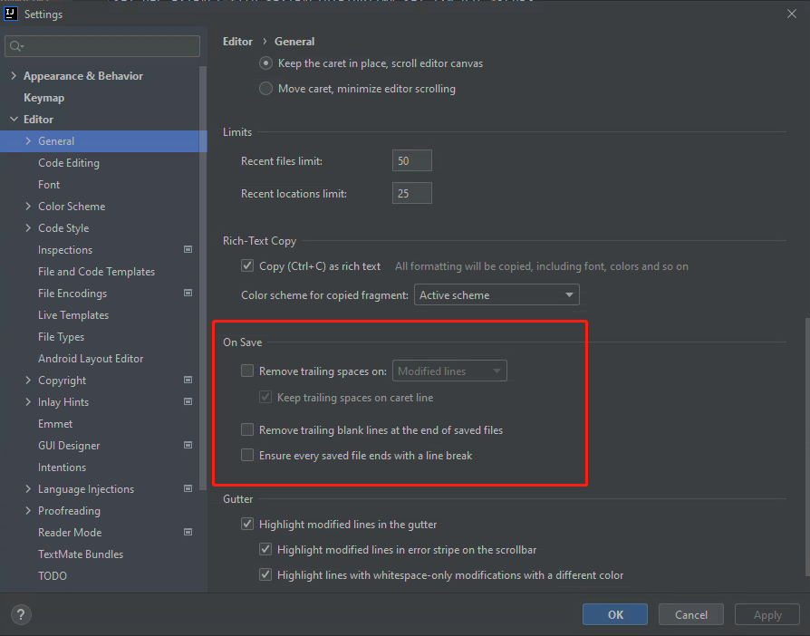

本指南旨在解决取消IDEA中去除尾随的空格的问题。

## 背景
修改了代码仓库中的代码，有些行尾是有空格的，提交后这些空格没有了，在代码仓库中看起来似乎修改了内容，但是实际没有修改。对于审查代码来说可能会造成困扰。

## 解决
IDEA默认在保存的时候会去除末尾的空格，如果不想要移除末尾的空格，我们只需要取消这个功能即可。如图：

更多详情请访问：[IT-eyes](https://it-eyes.top)