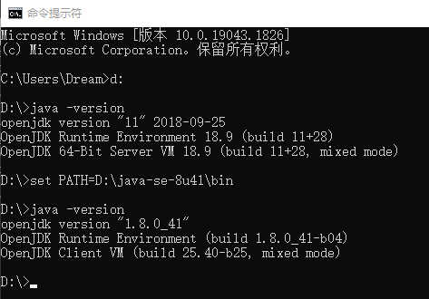

本指南旨在引导您在win10中快速切换jdk版本。

## 背景
本地有JDK8和JDK11，现在想在不配置系统环境变量的和重启电脑的情况下，快速切换使用JDK版本。

## 解决方法
在命令行执行如下命令，可以临时在控制台使用对应的jdk版本，当关闭命令行后失效。
>必须用CMD命令行，用powerShell不生效。

更多详情请访问：[IT-eyes](https://it-eyes.top)