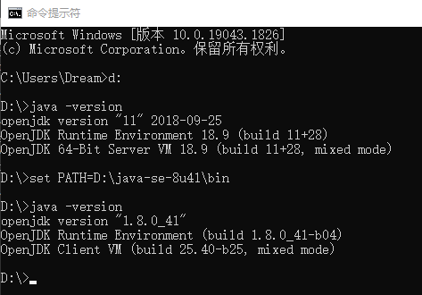

This Guide walks you quikly to switch JDK version in Win10.

## background
There are JDK8 and JDK11 locally, and now I want to quickly switch to the JDK version without configuring system environment variables and restarting the computer.

## Solution
Execute the following command on the command line to temporarily use the corresponding jdk version on the console, but it will be invalid when the command line is closed.
> The CMD command line must be used, and powerShell will not take effect.

For more details, please visit：[IT-eyes](https://it-eyes.top)