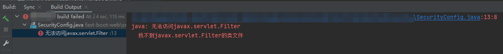

本指南旨在解决无法访问javax.servlet.Filter的问题。

## 背景
启动SpringBoot项目时，控制台抛出如图异常：

## 解决
因为`WebSecurityConfigurerAdapter`内部依赖`spring-boot-starter-web`,但项目中没有引入。需要在pom.xml中引入`spring-boot-starter-web`。

ssh-keygen -t rsa -m PEM
