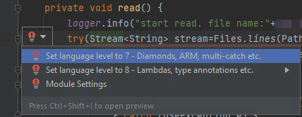
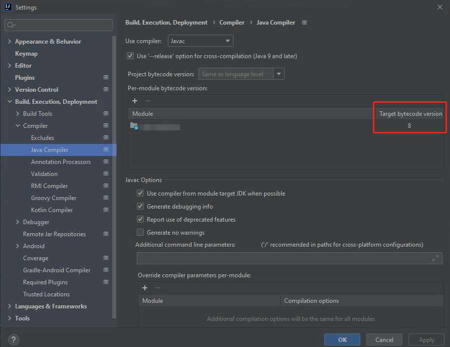
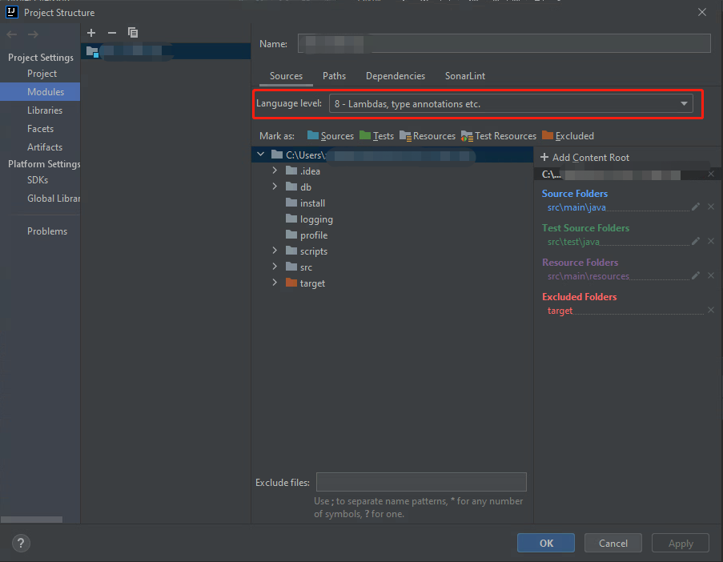

本指南旨在解决Set language to 8的问题。

## 背景
在使用IDEA编写代码的时候，如图有段代码出现了报错并提示“Set language to 8”。

## 解决
### 方法一：
在pom.xml中添加如下配置

<build>
    <plugins>
        <plugin>
            <groupId>org.apache.maven.plugins</groupId>
            <artifactId>maven-compiler-plugin</artifactId>
            <configuration>
                <source>8</source>
                <target>8</target>
            </configuration>
        </plugin>
    </plugins>
</build>


### 方法二：
在File->Settings->Build,Execution,Deployment->Compiler->Java Compiler,更改`Module`的`Target bytecode version`

在File->Project Structure,查看设置`Language level`

更多详情请访问：[IT-eyes](https://it-eyes.top)